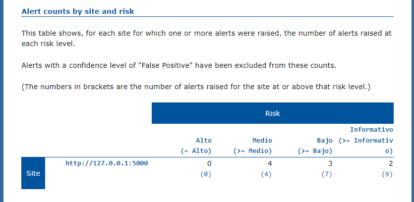

# EPCC_PROYECTO_FINAL_ING_SOFTWARE_II_2023
Repositorio para el Proyecto Final del curso de Ingenieria de Software II 2023

# Trabajo Final de Ingenieria de Software II: Pagina Web de eventos relacionados a computacion

## Proposito del Proyecto
Debido a los grandes avances y nuevas tecnologias relevantes para la sociedad de computacion que comprende entre investigadores, profesores, empresas, estudiantes y demas personas aficionados; esta pagina web pretende ser util para que los ponentes puedan notificar de sus proximos eventos a traves de una interfaz simple, y asi estos puedan mostrar mas interes a los temas tratados y agrandar la comunidad de ciencia de la computacion.

## Herramientas

-GitHub: Usamos este tipo de herramienta para crear un repositorio donde alojar nuestro proyecto. 
-JMeter: Es ua herramienta medir el rendimiento de una aplicación 
-SonarQube: Es una plataforma para evaluar código fuente. Es software libre y usa diversas herramientas de análisis estático de código fuente como Checkstyle, PMD o FindBugs para obtener métricas que pueden ayudar a mejorar la calidad del código de un programa. 
-Sonar-scanner  
-Unittest: Es un una libreria de programación para hacer pruebas unitarias, es el estándar de facto para las pruebas unitarias de una aplicación Python. Aunque, es popular para las pruebas unitarias, tiene soporte completo y provisión para pruebas de instrumentación también.  
-OWASP ZAP  
-Selenium: Es un entorno de pruebas de software para aplicaciones basadas en la web. Selenium provee una herramienta de grabar/reproducir para crear pruebas sin usar un lenguaje de scripting para pruebas.  

## Funcionalidades
La pagina web presenta entre sus principales funcionalidades:

### - Visualizar a traves de una interfaz grafica eventos relacionados a la computacion

### - Obtener mas informacion de los eventos

### - Acceder a los perfiles de los ponentes

### - Login

### - Register

### - Crear eventos

### - Ver nuevos eventos

  
## Github
Se ha realizado integracion continua sobre la rama de **desarrollo** en la cual se realizan las diferentes pruebas tanto unitarias, funcionales, de rendimiento, de seguridad y el analisis estatico.

## Pipeline en Jenkins
Para realizar el procedimiento completo de integración continua es necesario trabajar con Jenkins. Por ello se ha creado un pipeline con el siguiente script

## Construcción automática
En Python el tema de construcción automática no necesita de comandos específicos, pero si requiere un archivo requirements.txt el cual gaurdara todas las librerias usadas para el proyecto. Es necesario que para usarlo de forma correcta se use docker o un entorno virtual en python, de manera que solo se almacenen las librerias necesarias.

## Analisis Estático
-SonarQube official Plugin  
-SonarScanner Plugin  
-Sonar Qube Server  
-sonar-project.properties  

## Antes del Refactoring

## Previsualización del análisis de Sonar Scanner

## Vulnerabilidades
{width=250px}
## Code Smells

## Bugs

## Después del Refactoring

## Pruebas unitarias
Para las pruebas unitarias se ha utilizado la librería de unittest
Algunos ejemplos de test usados: 

Y este este es el resultado obtenido de haber corrido todos los test unitarios. Con la libreria unittest la forma de declarar que se ha pasado un test es con un punto y que ha fallado con la letra F.  

## Pruebas funcionales
Para las pruebas funcionales se ha hecho uso de selenium  

Y el resultado seria  

## Pruebas de seguridad
Para la pruebas de seguridad se ha hecho uso de Owasp zap
# Contenidos
 

##Sobre el reporte
 

##Sumario

 
 
 

##Apendice

 

## Pruebas de rendimiento
## Requisitos

- Jmeter
- Paths (JMeter, Proyecto, Output y URL)

Para esta sección usaremos la herramienta JMeter para hacer las pruebas de rendimiento en el proyecto. 

Iniciamos un plan de pruebas, con grupos de hilos y su respectivo HTTP.

Al finalizar generar un HTTP report del proyecto en JMeter, el cual nos dara un informe completo de este. 

## Conceptos DDD Aplicados
Domain Driven Design (DDD) es una práctica de desarrollo de software que pone el acento en el Dominio del Negocio como faro del proyecto y en su Modelo como herramienta de comunicación entre negocio y tecnología. 

La arquitectura implementada se divide en la siguiente estructura:

Arquitectura del proyecto: 

### Interface
Esta capa contiene todo lo que interactúa con otros sistemas, como los servicios web, las interfaces RMI o las aplicaciones web, y los frontales de procesamiento por lotes. Se encarga de la interpretación, validación y traducción de los datos entrantes. También se encarga de la serialización de los datos salientes, como HTML o XML a través de HTTP para los navegadores web o los clientes de servicios web.

### Application
La capa de aplicación se encarga de dirigir el flujo de trabajo de la aplicación en función de los casos de uso que se presentaron.
Estas operaciones son independientes de la interfaz y pueden ser tanto sincrónicas como basadas en señales. Esta capa es muy adecuada para abarcar las transacciones, el registro de alto nivel y la seguridad.

La capa de aplicación es poco exigente en cuanto a la lógica de dominio: se limita a coordinar los objetos de la capa de dominio para realizar el trabajo real.

### Domain
La capa de dominio es el corazón del software, es el núcleo de la lógica de negocio.
Aqui se realizan tareas como determinar si un evento de manipulación debe ser registrado y cómo la entrega de una carga se ve afectada por la manipulación.

La estructura y la denominación de los agregados, las clases y los métodos de la capa deberían seguir el lenguaje del grupo, y cualquier miembro debería ser capaz de explicar a un experto en el dominio cómo funciona cierta parte del software dibujando unos cuantos diagramas sencillos y utilizando los nombres reales de las clases y los métodos del código fuente.
